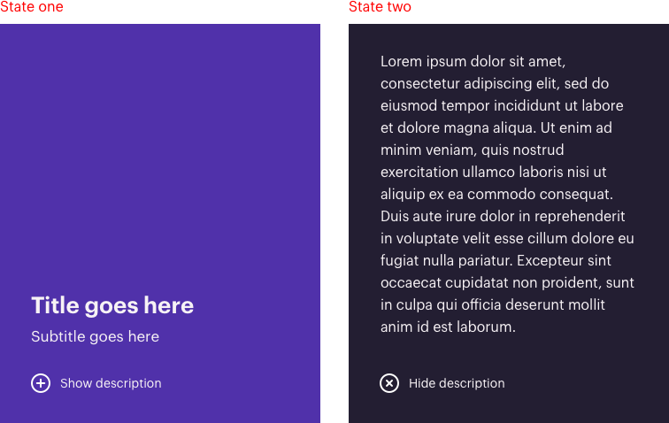

# Wiser | Junior Front End Developer Test

## About this test

This test should be completed to be considered for the Junior Front End Developer position at Wiser. The task will test your knowledge of HTML, SASS/CSS and JavaScript.

## Instructions

Fork this repo. After downloading a local copy, you will need to run commands `npm install` and then `npm run dev` in order to run the local development server. When you have completed the task, push your code and email a link to engineering@wearewiser.com to let us know! You should spend up to 2 hours on this task.

## The test

Below is an example of a typical UI component that you would build as a Junior Front End Developer at Wiser. The aim of this task is to replicate the design as accurately as possible, by writing HTML, SASS (or regular CSS if you wish) and vanilla JavaScript.

Deliverables:

- The component design is split into two states. Each time the icon/button is clicked, the component should toggle between states one and two.
- The component should be responsive for desktop and mobile devices.
- The component should be cross-browser compatible, the latest versions of Safari, Firefox and Chrome is fine.

Bonus points:

- Use SASS/CSS transitions and/or animations to transition between the component states one and two.

Notes:

- Other than those already installed, no external libraries/packages/plugins should be used to build this component.
- The HEX colour codes used in this design are `#5031AA`, `#231E32` and `#FFFFFFF`.
- The `font-family` used in this design can be found in `fonts.scss`
- The icon used in this design can be found in the `images` directory
- The placeholder description text has been taken from [loremipsum.io](https://loremipsum.io/)

If you have any questions, please feel free to email engineering@wearewiser.com.
